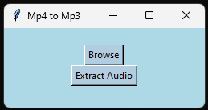

mp4-to-mp3 as simple as it sounds..

I needed to get the audio of (very) long files and didn't manage to find a free service online 

so I build a simple but efficient one ! Enjoy;)



# Installation :

1. Clone this repo to your local folser :
```bash
git clone https://github.com/Pathfainder/mp4-to-mp3.git
```

2. (optinal) Create a new Python environment in your local folder :
```bash
py -m venv your_env_name
```

3. Install `moviepy` to allow video processing :
```bash
pip install moviepy
```
4. Click on the adress bar on top of your folder and type `cmd`.
   
5. Activate your python environment : `your_env_name\scripts\activate`
   
6. Run :
```bash
py extract_gui.py
```

7. Enjoy ! ;)


Get Git here --> https://git-scm.com/downloads 

Python here --> https://www.python.org/downloads 

And Pip there --> https://pypi.org/project/pip 
